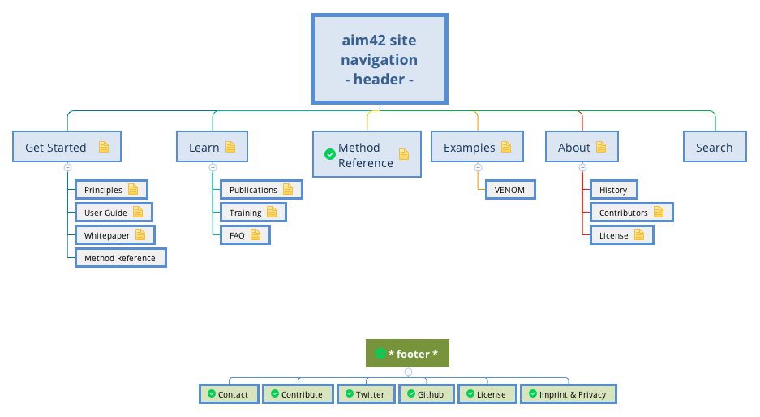

# aim42 Public Website

This repo contains the code for the aim42.org public website.

It's built with the Jekyll static site generator.

## Local development

Requirements: [Docker](https://www.docker.com/). No local Ruby needed.

    make build      # once, and after Gemfile.lock changes
    make dev        # serve on http://localhost:4242
    make check      # validate pattern front matter, unit tests, build, site tests

## Adding or editing a pattern

Patterns live in `_patterns/<slug>.md`, one file each; the filename is the URL:
`_patterns/stakeholder-interview.md` → `/patterns/stakeholder-interview/`.

    ---
    title: Stakeholder Interview
    phase: analyze            # analyze | evaluate | improve | crosscutting
    intent: "One sentence: what this practice achieves."
    related: [stakeholder-analysis]   # optional, slugs of other patterns
    categories: [approaches]          # optional
    status: complete          # complete | stub
    ---

    Short summary paragraph.

    ## Description
    ...
    ## Experience
    ...
    ## References
    ...

Rules (checked by `ruby tools/validate.rb`, in every Jekyll build and in CI):
`title`, `phase`, `intent` and `status` are required; `title` and `intent` are
strings; `intent` is one paragraph of inline Markdown (it is shown in lists and
the page description); `related` must list existing slugs; the filename is a
kebab-case slug, unique across `_patterns/`, and must not be `index` or a phase
name (`analyze`, `evaluate`, `improve`, `crosscutting`), which are reserved for
the index and phase pages. A `status: stub` pattern needs only the front
matter; the site shows a "help us write it" box.

Quote front-matter values that contain `: ` (colon followed by a space), as in
the `intent` above; otherwise YAML reads them as a nested mapping.

Glossary terms link to `/glossary/#term`, e.g. `[system](/glossary/#system)`.

## Site Structure

## Credits

##### Michael Rose, creator of the Minimal-Mistakes Jekyll Theme

- <https://mademistakes.com>
- <https://twitter.com/mmistakes>

#### Icons + Images:

* Free images can be found at [Unsplash](https://unsplash.com/)
* I generated the various favicon files with [RealFavIconGenerator](http://realfavicongenerator.net/).

---

## Licenses

### aim42
aim42 is licensed under a [CreativeCommons Sharealike International 4.0 License](https://creativecommons.org/licenses/by-sa/4.0/).

You are free to:

* **Share** — copy and redistribute the template in any medium or format
* **Adapt** — remix, transform, and build upon the material for any purpose, even commercially.

### [Minimal Mistakes Jekyll Theme](https://mmistakes.github.io/minimal-mistakes/)

##### The MIT License (MIT)

Copyright (c) 2016 Michael Rose

Permission is hereby granted, free of charge, to any person obtaining a copy
of this software and associated documentation files (the "Software"), to deal
in the Software without restriction, including without limitation the rights
to use, copy, modify, merge, publish, distribute, sublicense, and/or sell
copies of the Software, and to permit persons to whom the Software is
furnished to do so, subject to the following conditions:

The above copyright notice and this permission notice shall be included in all
copies or substantial portions of the Software.

THE SOFTWARE IS PROVIDED "AS IS", WITHOUT WARRANTY OF ANY KIND, EXPRESS OR
IMPLIED, INCLUDING BUT NOT LIMITED TO THE WARRANTIES OF MERCHANTABILITY,
FITNESS FOR A PARTICULAR PURPOSE AND NONINFRINGEMENT. IN NO EVENT SHALL THE
AUTHORS OR COPYRIGHT HOLDERS BE LIABLE FOR ANY CLAIM, DAMAGES OR OTHER
LIABILITY, WHETHER IN AN ACTION OF CONTRACT, TORT OR OTHERWISE, ARISING FROM,
OUT OF OR IN CONNECTION WITH THE SOFTWARE OR THE USE OR OTHER DEALINGS IN THE
SOFTWARE.
